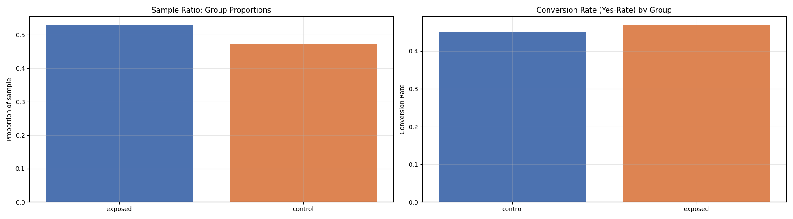

# Ad Campaign A/B Test

## 📌 Background
An advertising agency partnered with SmartAD to test whether an interactive ad format generates more questionnaire responses than the standard format. A controlled A/B experiment was conducted to measure the impact.

## 🧪 Experiment Design
- **Control**: Standard ad
- **Treatment**: Interactive ad
- **Metric**: Click-through rate (CTR) on the questionnaire
- **Sample**: Randomly assigned users

## 🔍 Key Findings
| Check | Result | Interpretation |
|-------|--------|----------------|
| **SRM Check** | p < 0.05 | ⚠️ Groups were not balanced — data quality concern |
| **A/B Test** | p = 0.556 | ❌ No statistically significant difference in CTR |

## 💡 Recommendation
The interactive ad did not show a significant lift in conversion. **However**, due to the detected SRM, this result is **provisional**. In a production environment, I would investigate the source of the imbalance before making any business decision.

## 🛠️ Technologies Used
- Python (Pandas, Matplotlib)
- Jupyter Notebook
- GitHub



## 🚀 Quick Start

```bash
# Clone repository
git clone https://github.com/aguchhait-stack/ad-ab-testing.git
cd ad-ab-testing

# Install dependencies
pip install -r requirements.txt

# Explore notebook
jupyter notebook notebook.ipynb
```

## 📄 License & Citation

[AdSmart AB Testing dataset](https://www.kaggle.com/datasets/osuolaleemmanuel/ad-ab-testing) (Kaggle).

## 👨‍💻 Author

**Arijit Guchhait**
[LinkedIn](https://www.linkedin.com/in/guchhaitarijit/)
